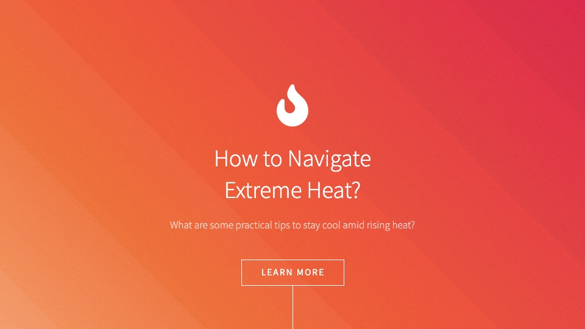

# "Extreme Heat Advice"
CRUD web application that allows users to add and view advice on how to navigate period of extreme heat.

**Link to project:** https://extreme-heat-advice.herokuapp.com/

## How It's Made:

**Tech used:** EJS, CSS, JavaScript, SASS, Node, MongoDB

This web app was designed to help crowdsource tips on navigating periods of extreme heat. It is a full-CRUD app with a functional delete option but the delete button has been commented out for public interaction. The app runs on Node and stores/pulls all entries from MongoDB.

## Optimizations

I would like to incorporate a login system so that moderators can be given the option to delete certain entries. I would also like to duplicate this model and perhaps house them in a hub where users have access to crowdsourcing on various topics. I also need to host it elsewhere since Heroku is ending its free tier.

## Lessons Learned:

This app gave me the opportunity to play around in more depth with several CSS concepts such as z-index and gradient borders. I enjoyed it a great deal.

